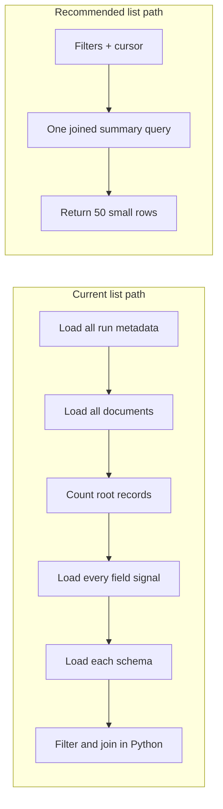
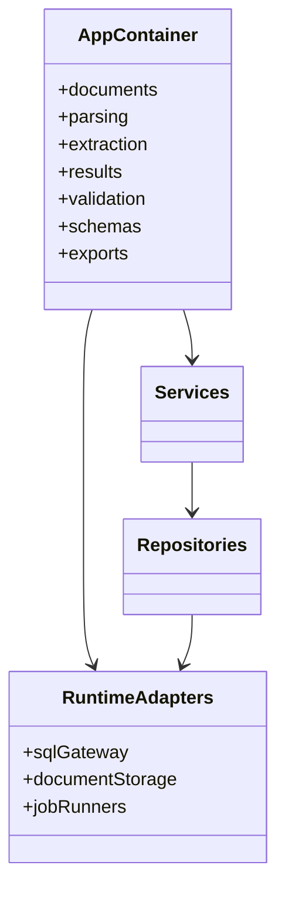
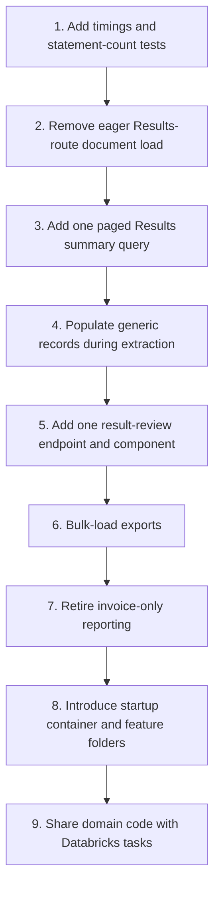

# Performance and Simplification Review

Last reviewed: 2026-08-31

## Executive recommendation

Make the Results list a small, paged read model served by one Databricks SQL statement. Do not
reconstruct record trees or scan every extracted field when rendering a list row. Remove the two
expensive counters from the list unless the product needs them; if they are needed, calculate and
store them when extraction completes.

In parallel, stop loading the whole document registry when the active route is Results, and make
the extraction job populate the generic record/field structure once. Those changes address list
latency, detail latency and export latency at the point where the data is produced.

For maintainability, converge on the schema-generic Results/review/export path, then delete the
older invoice-specific reporting path. Next, replace repeated service construction and ad hoc
frontend fetching with one application container and a small typed API layer.

## Evidence from the current implementation

The previous Results implementation performed detail work for every list row and selected every
run's complete `ai_result`. With 28 runs it made roughly 57 sequential warehouse round trips and
timed out with HTTP 502. Commit `d9f26ac` correctly replaced that N+1 path with bulk reads.

The live evidence recorded in `PROJECT_CONTEXT.md` is:

| Measurement | Observed state |
|---|---:|
| Documents | 11 |
| Extraction runs | 28 total: 24 extracted, 4 failed |
| Documents API | 4.1 seconds |
| Results API before bulk fix | Gateway timeout / HTTP 502 |
| Results API after bulk fix | 7.9 seconds |

The remaining 7.9 seconds is consistent with statement latency, not React rendering. The Results
service currently executes, in sequence:

1. one statement for extraction-run metadata;
2. one statement for all documents;
3. one statement for root-record counts;
4. one statement for every field's issue inputs; and
5. one statement for each distinct schema version present in the runs.

If `D` schema versions are present, `/api/extractions` therefore costs `4 + D` warehouse
statements. On a direct browser load, `App.tsx` also requests the full document list and distinct
cases, adding two more statements. The initial Results route costs `6 + D` statements even though
the visible table is small.

The endpoint exposes `case_id`, `document_id`, `schema_id` and `status` parameters, but filtering
happens after all runs, documents, root counts and field signals have been loaded. The frontend
does not send the filters at all; it downloads up to 2,000 runs and filters in memory.

## Why the documents page feels better

The documents list maps closely to one bounded query:

```text
SELECT document columns
FROM documents
WHERE optional case filter
ORDER BY uploaded_at DESC
LIMIT 500
```

The Results list composes data in Python from multiple queries across runs, documents, records,
fields and schemas. The difference is round-trip count and work per row, not a meaningful React
performance difference.

## Target architecture for Results



The query should join extraction runs to documents and schema registry, calculate “latest” with a
deterministic `ROW_NUMBER`, apply filters before the joins fan out, and return one page. It should
not select `ai_result`, `citations`, source paths or full field values.

## Prioritized performance changes

### P0 — Add timing before changing behavior

Add structured timings for each repository statement and a `Server-Timing` header for the list and
detail endpoints. Record at least:

- total API duration;
- SQL statement count and cumulative SQL duration;
- returned row count and serialized response bytes;
- browser time to first row; and
- warm-warehouse versus cold-warehouse measurements.

Suggested acceptance targets for the current data volume are under 2 seconds warm and under 4
seconds cold for the first 50 Results rows. These are targets to validate, not claims about the
current warehouse.

### P1 — Make the list one server-side, paged query

Add a Results-specific repository method instead of composing generic repositories in
`ExtractionResultsService.list_summaries`.

The public contract should accept:

```text
limit=50
cursor=<started_at + extraction_run_id>
latest_only=true
case_id=<optional>
schema_id=<optional>
status=<optional>
search=<optional file-name prefix/term>
```

Use cursor pagination rather than `OFFSET`, because immutable runs already have a stable sort key.
Return `items` and `next_cursor`; do not silently cap a list at 2,000 rows.

Expected effect: `4 + D` SQL statements become one statement, payload size is bounded, and filters
reduce work at the database rather than after transfer.

### P1 — Remove or materialize the expensive counters

The current list shows `records_count` and `issues_count`:

- `records_count` counts root nodes. The walker creates exactly one document root, so it is
  structurally 0 or 1 and reports 1 for a document containing three invoices. The label does not
  currently mean what a user is likely to infer.
- `issues_count` requires reading all flattened fields and applying each schema's confidence and
  citation policy.

Recommended product decision: remove both columns from the list and keep review signals in the
detail page. This produces the smallest and fastest useful list.

If the counters are required, compute accurate `top_level_item_count` and `review_signal_count`
inside the extraction job and retain them on the extraction run (or a run-summary projection).
List reads then remain O(number of visible runs), not O(number of extracted fields).

### P1 — Stop route-independent document loading

`App.tsx` loads all documents and cases on every initial route. On `/results` the document array is
not used by the page, and the Results service separately loads the same registry to obtain names
and cases.

- Load document rows only for `/` and document workflow routes.
- Let the joined Results query supply document name and case.
- Derive Results filter options from the response or expose a small cached filter-metadata
  endpoint.
- Keep health independent so the shell can render quickly.

Expected effect: two unnecessary SQL statements disappear from a direct Results load.

### P1 — Populate the generic tree during extraction

The generic result cache cannot hit in the deployed environment: existing `extracted_fields` rows
have null generic identifiers, the job does not populate them, and the App has read-only access to
that table. Opening a detail result therefore re-walks raw `ai_result` and attempts a write that
cannot succeed.

Move `walk_extraction` and generic persistence into the extraction job transaction:

- write `extracted_records` once;
- populate `record_id`, `schema_path`, `instance_path` and `declared_type` on fields once; and
- remove app-side write-through behavior after retained runs have been backfilled.

This needs no extra App write grant because the job is already the writer. It also makes exports
read retained relational data instead of rebuilding every selected run.

### P1 — Collapse result-detail loading into one view model

The detail page currently requests result and record endpoints in parallel, then requests document
and schema details in a second wave. Both first-wave endpoints reload the same run and schema, and
the generic records response includes record rows that the page does not render.

Provide one review endpoint containing:

- run metadata and hierarchy;
- display-safe document identity and status;
- field values, confidence and citations;
- the field policies needed for flags; and
- page metadata or a URL template for the viewer.

Keep the low-level endpoints only if another real client needs them. This removes four browser
requests, duplicate run/schema reads and the sequential second wave.

### P2 — Make multi-run export bulk, then asynchronous at scale

`ExportService._load_tables` currently loads runs sequentially and performs an additional document
lookup for each run. For a selection of `N` runs this reintroduces N+1 behavior.

- Add `WHERE extraction_run_id IN (...)` bulk repository methods for runs, records, fields and
  document names.
- Build small exports synchronously from those bulk rows.
- For large selections, create an export job and return a job identifier rather than holding an App
  request open while a workbook is built.

### P2 — Cache only stable reference data

Schema versions are immutable and are ideal for in-process caching by `(schema_id, version)`.
Case/filter metadata can use a short TTL. Do not cache active run status or mutable document status
without explicit invalidation.

### P3 — Optimize Delta layout only after query consolidation

At larger volumes, inspect query profiles and consider liquid clustering on common immutable keys
such as `extraction_run_id`, `document_id` and `started_at`. This will not compensate for many
sequential SQL statements and is not the first fix at 28 runs.

## Performance acceptance matrix

| Scenario | Required behavior | Suggested target |
|---|---|---:|
| Results, default latest-only | First 50 rows, no raw results/fields | <2s warm, <4s cold |
| Change status/schema/case filter | Server-filtered first page | <2s warm |
| Open a previously extracted run | Values and field flags visible | <3s warm before page image |
| Open a newly extracted run | No app-side persistence attempt | Same path as an older run |
| Export 25 modest runs | Bulk reads, one generated file | <10s or asynchronous handoff |
| 500+ runs | Stable memory and payload size | Page size remains bounded |

Every performance test should assert SQL statement count as well as elapsed time. This prevents a
fast local SQLite test from hiding a warehouse N+1 regression.

## Codebase size and concentration

The repository currently contains approximately:

| Area | Lines |
|---|---:|
| Backend application source | 10,543 |
| Frontend source excluding frontend tests | about 4,810 |
| Databricks Python tasks | 1,145 |
| Backend and frontend tests | about 6,682 |

The main concentration points are `extraction_runs.py` (1,054 lines), `validation.py` (1,027),
`ExtractionPanel.tsx` (753), `SchemaEditor.tsx` (737), `extract_document.py` (691), the shared CSS
(625), `extraction_result.py` (589), `DocumentViewer.tsx` (532), and `dependencies.py` (496).
Large files are not automatically wrong, but these files mix several reasons to change.

## Prioritized simplification changes

### S1 — Choose the generic reporting path and retire the invoice-only path

There are now two reporting/export stacks:

- legacy invoice-specific `GET /api/results/invoices`, `GET /api/exports/invoices.xlsx` and
  `services/reporting.py`; and
- schema-generic `/api/extractions`, `/api/extractions/{runId}` and `POST /api/exports`.

Once the generic workbook and UI meet the required invoice use cases, deprecate the old endpoints,
verify no deployed client uses them, then remove their response models, service/repository and
tests. `services/reporting.py` alone is 440 production lines; the complete removal is likely to
delete roughly 650–850 source and test lines.

Keep the governed invoice projection only if analytics or downstream SQL consumers still require
it. API retirement and data-projection retirement are separate decisions.

### S1 — Have one extraction review workspace

The document page's invoice-oriented `ExtractionPanel` and the Results page's generic result detail
both render extraction values beside the same `DocumentViewer`. Select one canonical review
component and reuse it from both routes. The document route can add workflow actions around that
component; it should not own another result renderer.

This removes duplicated fetching, selection, evidence and result-state logic. Depending on the
retained workflow controls, a consolidation should remove roughly 400–800 production/test lines.

### S1 — Build one application container at startup

`api/dependencies.py` contains eight builder functions. Each repeats mode checks, configuration
validation, `WorkspaceClient` construction and repository wiring. Construct an `AppContainer` once
during FastAPI lifespan and store shared adapters/services on `app.state`.



FastAPI dependency functions then become small accessors. This reduces composition code, makes
resource sharing explicit, and gives tests one place to replace adapters.

### S2 — Add a small typed frontend API layer

There are 38 direct `fetch` calls spread across pages and components, each recreating some mix of
status checking, JSON parsing, abort behavior and error messages.

Use a small `api/client.ts` with typed `getJson`, `postJson` and `download` functions, plus focused
hooks for resource loading and polling. A full state framework is not required. Centralize:

- the public error envelope;
- abort handling;
- request identifiers and timing;
- download filename parsing; and
- consistent loading/error retention behavior.

This should reduce component state code and make the browser request graph visible in one place.

### S2 — Share extraction-domain code with the Databricks job

`backend/services/extraction_result.py` and `databricks_etl/src/extract_document.py` independently
implement schema walking, citation resolution, scalar normalization and invoice projection. Hash
normalization is also independently implemented in backend and registration/extraction tasks. The
project history already records a drift defect across those copies.

Package the pure domain functions in the backend wheel (or a small shared package) and install that
wheel in the Databricks job environment. Leave Spark reads/writes in the task, but call one tested
implementation for walking, normalization and projection. This is both a line-count reduction and
a correctness improvement.

### S2 — Split by feature and adapter, not by arbitrary file size

Recommended backend shape:

```text
idp_app/
  features/
    documents/       api.py, service.py, models.py
    parsing/         api.py, service.py, domain.py
    extraction/      api.py, service.py, domain.py, results.py
    validation/      api.py, service.py, validators/
    schemas/         api.py, service.py, domain.py
    exports/         api.py, service.py, workbook.py
  infrastructure/
    sqlite/
    databricks/
      sql_gateway.py
      repositories/
  container.py
```

In particular:

- split `extraction_runs.py` into protocol/models, SQLite repository, Databricks repository and
  row mapping;
- split `validation.py` into structural validators and one module per declarative rule family;
- rename `validation.py`, `validation_service.py` and `validation_runs.py` so “engine”,
  “orchestration” and “repository” are obvious; and
- keep pure domain functions free of FastAPI, Spark and Databricks SDK imports.

This reorganization does not reduce lines by itself. Do it while consolidating behavior, not as a
standalone large move.

### S2 — Register schema manifests through one collection

Adding schema v4 required a job task, an allowlist edit and a validator expectation edit. Keep the
source-controlled allowlist, but have the bootstrap task iterate that one allowlisted collection.
Configuration validation should inspect the same collection instead of maintaining another list.

### S3 — Remove stale documentation after the new guides are accepted

`PROJECT_CONTEXT.md` contains valuable evidence but also preserves a long chronological build log
and some early statements that no longer describe the current app. Keep evidence in dated release
notes, keep `PROGRESS_TRACKER.md` concise, and use `SOLUTION_GUIDE.md` as the maintained current
explanation. This makes onboarding materially easier without deleting audit history from Git.

## Estimated deletion opportunity

These ranges are planning estimates, not measured diffs.

| Consolidation | Estimated removable lines | Dependency |
|---|---:|---|
| Retire invoice-only reporting API/service/tests | 650–850 | Generic export accepted |
| One extraction review UI and request path | 400–800 | Workflow behavior chosen |
| Startup container replacing repeated builders | 150–300 | Service construction tests |
| Typed frontend client and shared loaders | 150–300 | Incremental component migration |
| Shared backend/job extraction domain | 200–400 | Job consumes packaged code |
| **Potential total** | **1,550–2,650** | Avoid double-counting during implementation |

The best outcome is not the smallest possible repository. It is one canonical path per user task,
one implementation of each domain rule, and one query shape for each screen.

## Suggested delivery sequence



Keep each step independently deployable. The performance work should land before the broad file
reorganization so measurements can prove which behavior changed.

## Changes not recommended yet

- Do not split the application into microservices; the current boundaries do not need network
  boundaries.
- Do not add Redux solely for server data; a typed API layer and focused hooks are sufficient.
- Do not rewrite repositories around a new ORM until the single-query read model has been tested;
  Databricks statement latency, not SQL syntax generation, is the current bottleneck.
- Do not rely on browser virtualization as the primary list fix. It reduces DOM work but does not
  reduce warehouse statements or payload generation.
- Do not grant the App broad table modification privileges to make a read-time cache work. Persist
  derived extraction data in the writer job instead.
