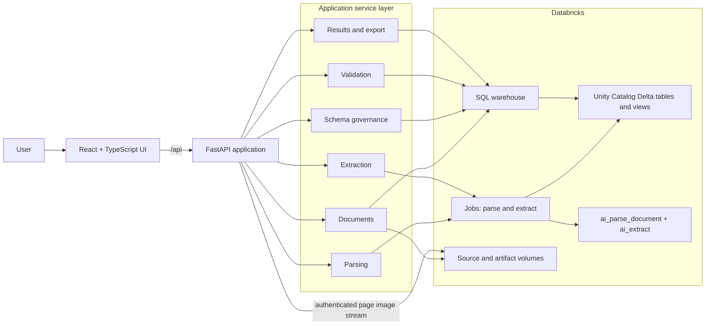
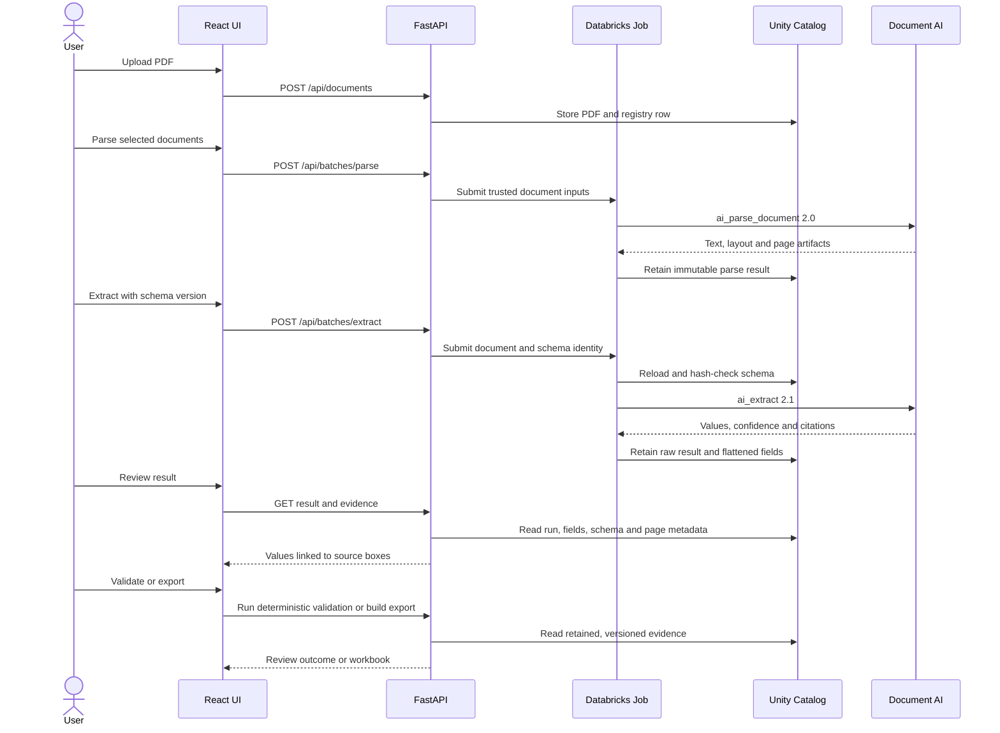
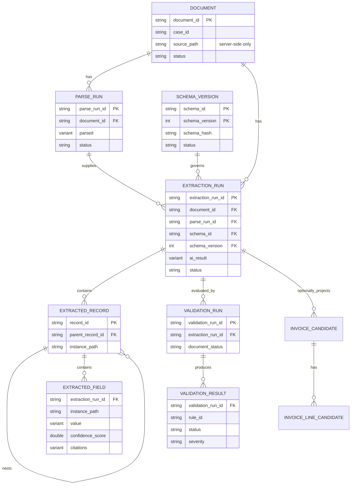
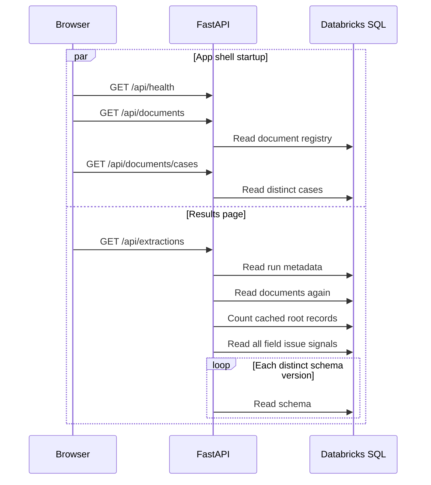

# IDP MVP Solution Guide

Last reviewed: 2026-08-31

This is the presentation-oriented guide to the current application. It explains the system at a
level that is useful in a technical walkthrough without requiring the audience to know the source
tree. For implementation history and deployment evidence, use
[`PROJECT_CONTEXT.md`](PROJECT_CONTEXT.md). For the performance and simplification backlog, use
[`PERFORMANCE_AND_SIMPLIFICATION_REVIEW.md`](PERFORMANCE_AND_SIMPLIFICATION_REVIEW.md).

## The solution in one minute

The application turns source PDFs into reviewable, governed extraction results.

1. A user uploads one or more PDFs and optionally assigns a case.
2. A parsing job retains the document text, layout elements and page images.
3. An extraction job loads an approved versioned schema, calls `ai_extract`, and retains both the
   raw model response and flattened field/evidence rows.
4. Deterministic validation evaluates provenance, schema integrity, evidence, confidence and the
   rules declared by that exact schema version.
5. The user reviews values beside the source page, follows citations to the relevant region, and
   exports selected runs.

The central design choice is immutability: parsing, extraction and validation create new attempts
instead of overwriting history. A result can therefore always be tied back to the source document,
parse attempt, extraction schema and validation run that produced it.

## System architecture



The same service interfaces also have SQLite and local-filesystem implementations. That mock path
is valuable because it exercises the API and UI without Databricks credentials; it is an adapter,
not a separate application.

## End-to-end workflow



## Governed data model

The diagram shows the logical ownership rather than every column.



There are three representations of extraction data, each serving a different need:

| Representation | Purpose | Retention rule |
|---|---|---|
| Raw `ai_result` | Auditability and faithful reconstruction | Always retained on the immutable extraction run |
| Generic records and fields | Schema-independent review and export | One record tree for any nested schema shape |
| Invoice candidate tables | Convenient typed analytics for the current invoice use case | A projection, never the authoritative model result |

## How the results experience works today

The list and detail pages have different responsibilities.

- `/results` lists extraction attempts and lets the user filter and select runs for export.
- `/results/:runId` reconstructs the hierarchical result, displays values and evidence, and keeps
  the source page beside the result.
- `/documents/:documentId` is the workflow view: parse, extract and validate one document while
  retaining its source viewer.

On a direct visit to the results list, the browser currently starts health, document, case and
extraction-list requests. The extraction-list service then performs several Databricks reads of
its own. This is the main performance boundary discussed in the companion review.



## Source-code map

| Area | Entry point | Main responsibility |
|---|---|---|
| Application shell | `frontend/src/App.tsx` | Routing, runtime status and document/case state |
| Documents list | `frontend/src/pages/DocumentsPage.tsx` | Upload, case/status/search filters and batch selection |
| Document workflow | `frontend/src/pages/DocumentDetailPage.tsx` | Source viewer with extraction, validation and history tabs |
| Results list | `frontend/src/pages/ResultsPage.tsx` | Run filtering, selection and generic export |
| Result review | `frontend/src/pages/ResultDetailPage.tsx` | Hierarchical result beside citation evidence |
| HTTP API | `backend/src/idp_app/api/` | Public routes, request validation and response models |
| Service composition | `backend/src/idp_app/api/dependencies.py` | Chooses mock or Databricks adapters and constructs services |
| Workflow services | `backend/src/idp_app/services/` | Use cases, repositories, validation, projections and exports |
| Databricks tasks | `databricks_etl/src/` | Code executed by parsing, extraction and schema-registration jobs |
| Governed objects | `databricks_etl/sql/` | Delta tables, migrations and derived views |
| Deployment | `databricks_etl/resources/` | Asset Bundle jobs and Databricks App resource |

When following a request through the code, use this order:

```text
React page/component -> api/<feature>.py -> <feature> service -> repository protocol
                     -> SQLite adapter (mock) or Databricks adapter (deployed)
```

## Design decisions worth explaining

### Immutable attempts

Retries do not mutate prior results. This makes failures inspectable and makes “latest” a query,
not destructive state.

### Governed schema identity

The browser sends a schema ID and version, not arbitrary extraction JSON. The job reloads the
registered contract and checks its hash before extraction. That closes the gap between what the
user saw and what the model executed.

### Evidence stays attached to values

Confidence is metadata, not correctness. Citations link a value back to a page and bounding box;
the source PDF and internal volume paths stay behind the API.

### Generic core, optional typed projection

The generic record tree supports arbitrary nested schemas. Invoice candidate tables are an
analytics convenience and can be retired or replaced without losing the retained model result.

### Synchronous reads, asynchronous processing

Parsing and extraction use Jobs because they are long-running and retryable. Registry, result and
validation reads are synchronous API operations. This boundary is simple, but it means list APIs
must avoid multiple sequential warehouse statements.

## A seven-minute presentation outline

1. **Problem (45 seconds):** document extraction must be reviewable and auditable, not just a model
   response.
2. **Journey (90 seconds):** upload, parse, extract, inspect evidence, validate, export.
3. **Architecture (90 seconds):** React and FastAPI orchestrate; Databricks Jobs do long-running
   work; Unity Catalog retains governed state and artifacts.
4. **Trust model (90 seconds):** immutable attempts, hashed schemas, server-owned paths, citations
   and deterministic validation.
5. **Data model (60 seconds):** raw response for audit, generic tree for any schema, typed invoice
   projection for reporting.
6. **Current engineering focus (45 seconds):** make results reads one bounded query and remove the
   duplicate legacy/generic paths.
7. **Close (30 seconds):** the MVP proves the governed workflow; the next work makes it faster and
   easier to own without changing that contract.

## Operational points not to miss

- Batch `for_each` concurrency is explicitly configured; its platform default would be serial.
- `app.yaml` must remain independently bootable. A non-bundle deployment reads it directly.
- Replacing a Unity Catalog view can remove the App's grant; the documented two-pass deployment
  reapplies bindings.
- Source PDFs, internal volume paths, raw parser output and credentials are never public API data.
- The local mock is a development adapter. A deployed App must report `mode=databricks` on
  `/api/health`.
